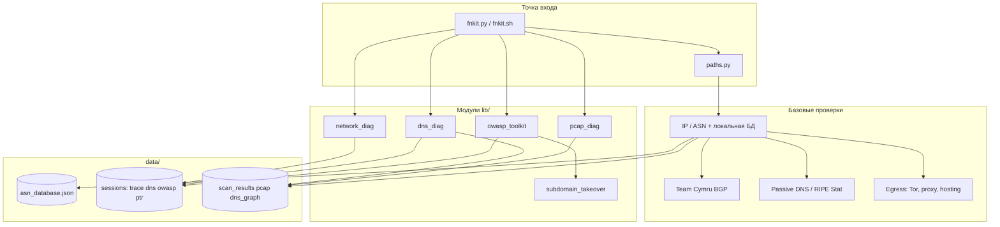

# FieldNet Kit (FNkit)

**Портативная сетевая разведка из одного терминала** — сверка IP/ASN с вашей базой, контекст BGP и passive DNS, затем DNS-граф, trace, PCAP или OWASP-проверки без переключения между инструментами.

> Ранее репозиторий назывался *ip_checker*. GitHub: **[klavdiy/fieldnetkit](https://github.com/klavdiy/fieldnetkit)**

---

## За 15 секунд

Вставляете IP из алерта файрвола, тикета или `kubectl get svc`. **FNkit отвечает за один проход:** совпадает ли гео с ожидаемым ASN, кто владеет префиксом *прямо сейчас* (BGP), был ли адрес на Tor exit или CDN вчера (egress + passive DNS), куда писать по abuse — до того как вы откроете шесть вкладок или поверите `/8` в CMDB.

```bash
./fnkit.sh -i 203.0.113.45          # интерактивно + меню инструментов
python3 fnkit.py -i 8.8.8.8 -s      # CLI + отчёт в data/scan_results.json
```

---

## Когда FNkit реально выручает

| Ситуация | Без FNkit | С FNkit |
|----------|-----------|---------|
| **SOC: страна «не та»** | Спор ip-api vs CMDB, ручной whois | Mismatch + карантин: whois ≠ geo → **без ложной записи в БД**; BGP origin vs ваша база |
| **Инцидент: новый IP в логах** | «Это наш VPS или взлом?» | Egress: Tor/proxy/hosting + passive DNS: **кто ещё сидел на этом IP** |
| **AppSec: поддомен после утечки DNS** | Отдельно Amass, headers, чеклисты takeover | Pipeline: headers → TLS → Amass → **висящий CNAME** (~50 отпечатков) |
| **SRE: «стало медленно»** | speedtest в браузере, trace в другом окне | Меню **4**: speed-test + **trace в стиле MTR** → JSON → replay позже |
| **Форензика: pcap на ноутбуке** | Wireshark + ручной DNS | PCAP → DNS crawl → **HTML-граф** в `data/dns_graph/` |

<details>
<summary><strong>Пример: mismatch, который испортил бы вашу ASN-базу</strong></summary>

```text
Checking IP: 195.20.1.1
✗ MISMATCH: Expected RU | Actual DE
BGP origin: AS12389 — matches DB ASN, geo does not
⚠ Conflict quarantined: WHOIS and ip-api disagree. No DB write performed.
```

Вы продолжаете расследование, а не помечаете весь AS как «Германия» автоматически.

</details>

---

## Архитектура



**Структура:** `fnkit.py` в корне репозитория · модули Python в `lib/` · базы, конфиг и сессии в `data/` (старые пути из корня переносятся при первом запуске).

---

## Почему FNkit, а не …

| Задача | Обычный набор | FNkit |
|--------|---------------|-------|
| «Чей это IP?» | whois + ip-api в браузере | Один TUI/CLI: гео + **ожидаемая страна из вашей БД** + mismatch/карантин |
| Правда о префиксе | RIPEstat / bgp.tools | **Живой Cymru origin** vs статические пулы; пулы **≥ /20**, без ложного match по `/8` |
| Исторический контекст | Вкладки VirusTotal, SecurityTrails | **passive DNS** + опциональные API-ключи (меню 7) в том же отчёте |
| Поверхность атаки | Amass + httpx + свои скрипты | **OWASP pipeline**: headers (проверка значений), TLS, Amass, takeover |
| Карта DNS | циклы dig, таблицы | **DNS-граф**: crawl, crt.sh, HTML, сравнение резолверов |
| Форензика на ноутбуке | только Wireshark | **Захват/просмотр PCAP** + DNS-seed из `tshark` |

FNkit не заменяет SaaS-сканеры — это **полевой верстак**, когда у вас уже есть shell и нужны обоснованные ответы быстро, по возможности без лишних облаков.

---

## Скриншоты

> Добавьте GIF/PNG в `docs/assets/` и пропишите ссылки здесь (PR приветствуются).

| Экран | Файл (план) |
|-------|-------------|
| Баннер egress + главное меню | `docs/assets/menu-main.png` |
| IP mismatch + карантин | `docs/assets/ip-mismatch.png` |
| Монитор маршрута (TTY) | `docs/assets/trace-monitor.gif` |
| HTML DNS-граф | `docs/assets/dns-graph.png` |
| OWASP secure headers | `docs/assets/owasp-headers.png` |

Пока нет ассетов — запустите локально:

```bash
./fnkit.sh    # меню + рамка egress
python3 fnkit.py -i 1.1.1.1 --owasp-headers https://example.com
```

---

## Быстрый старт

```bash
chmod +x fnkit.sh scripts/install-deps.sh
./scripts/install-deps.sh minimal    # Python, whois, ping
./fnkit.sh
```

```bash
python3 fnkit.py -h
python3 fnkit.py --check-deps --check-deps-hints
python3 fnkit.py -i 8.8.8.8
```

Windows: `.\scripts\install-deps.ps1 -Profile minimal` → `.\fnkit.ps1 -i 8.8.8.8`

Опционально: `pip install -r requirements-dns.txt` (меню DNS), `requirements-optional.txt` (MaxMind / IP2Location).

---

## Что внутри (кратко)

| Область | Возможности |
|---------|-------------|
| **Доверие** | Локальная ASN-БД, geo mismatch, авто-переклассификация с карантином |
| **Контекст** | BGP origin, passive DNS, сигналы egress/NAT |
| **Диагностика** | Speed-test, параллельный монитор хопов, PCAP |
| **DNS** | BFS crawl, crt.sh, сравнение резолверов, HTML vis-network |
| **Безопасность** | OWASP headers/TLS, Amass, subdomain takeover, ссылки WSTG |
| **Эксплуатация** | Раскладка `data/`, SBOM, CI validate, `--maintain-db` |

---

## Документация

| Документ | Содержание |
|----------|------------|
| **[docs/USER_GUIDE.md](docs/USER_GUIDE.md)** | Полный мануал: все пункты меню, флаги CLI, форматы JSON, troubleshooting |
| [docs/SCHEMA.md](docs/SCHEMA.md) | Версии схем JSON, миграции, совместимость с `ip_checker_*` |
| [docs/SBOM.md](docs/SBOM.md) | Зависимости, регенерация SBOM |
| [docs/OWASP_INTEGRATION.md](docs/OWASP_INTEGRATION.md) | OWASP pipeline, сторонние инструменты |
| [docs/OWASP_THIRD_PARTY.md](docs/OWASP_THIRD_PARTY.md) | Лицензии, authorized use |

---

## Структура проекта

```text
fnkit.py, fnkit.sh, fnkit.ps1, paths.py, schema.py
lib/          network_diag, dns_diag, pcap_diag, owasp_toolkit, …
data/         asn_database.json, config/, sessions/, pcap/, cache/
scripts/      check_deps, validate_asn_db, install-deps
docs/         USER_GUIDE, SBOM, OWASP
```

---

## Сообщество и лицензия

- [Contributing](CONTRIBUTING.md) · [Code of Conduct](CODE_OF_CONDUCT.md) · [Security](.github/SECURITY.md)
- **Лицензия:** [MIT](LICENSE)

**Только с разрешением** на цели, которыми вы владеете или имеете право тестировать (nmap, Amass, DNS brute, Nettacker).
