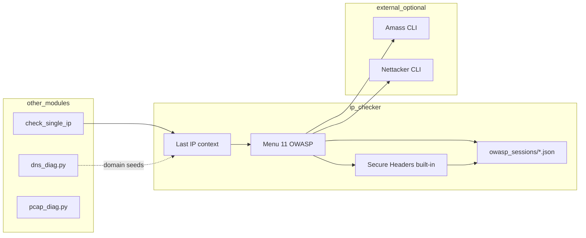

# OWASP integration (menu 11) — design and examples

## Architecture



## Links to project components

| ip_checker part | OWASP step | Automation idea |
|-----------------|------------|-----------------|
| `check_single_ip` → context | Pipeline default IP | After IP check, menu 11 pre-fills IP |
| `dns_diag` seed domain | Amass passive | `example.com` from DNS graph → Amass |
| `offer_network_tools` nmap | WSTG INFO/CONF | Open ports → WSTG checklist items |
| `scan_results.json` | Batch pipeline | CI reads JSON, runs `--owasp-headers` on discovered hosts |
| `asn_database.json` | Org domain guess | Manual domain from WHOIS org field → Amass |
| PCAP / `dns_diag` PCAP | WSTG INFO | Names from PCAP → DNS crawl (10) then Amass (11) |

## CLI examples

```bash
# Built-in Secure Headers (no extra install)
python3 ip_checker.py --owasp-headers https://example.com

# WSTG pointers only (links)
python3 ip_checker.py --owasp-wstg

# Amass (requires: brew install amass / go install, etc.)
python3 ip_checker.py --owasp-amass example.com --owasp-save

# Full pipeline: headers + amass + WSTG; Nettacker only with explicit flag
python3 ip_checker.py --owasp-pipeline --owasp-ip 203.0.113.10 --owasp-domain example.com --owasp-save

# Pipeline including Nettacker port_scan (AGPL tool must be installed)
python3 ip_checker.py --owasp-pipeline --owasp-domain example.com --owasp-nettacker-run --owasp-save
```

## Interactive flow (menu 11 → 1)

1. Accept authorized-use disclaimer (once per process).
2. Confirm IP/domain (defaults from last IP check).
3. **Secure Headers** on `https://<domain>/` if URL/domain known.
4. Optional **Amass** passive enum → subdomain list sample.
5. Optional **Nettacker** `port_scan` on IP or domain (AGPL warning).
6. **WSTG** checklist printed with owasp.org links.
7. Save combined JSON under `owasp_sessions/`.

## GitHub Actions sketch

```yaml
# Optional job — does not install Amass/Nettacker by default
- name: OWASP headers on staging
  run: |
    python3 ip_checker.py --owasp-headers "${{ vars.STAGING_URL }}" --owasp-save
```

## Future implementation ideas

1. **`--owasp-from-dns FILE`** — read `dns_sessions/*.json`, take apex domains, run Amass passive batch.
2. **`--owasp-from-scan`** — parse last `scan_results.json` IPs; resolve PTR; headers only on :443 open (from nmap parse).
3. **Unified report** — merge `owasp_sessions`, `dns_sessions`, `scan_results` into one HTML dashboard (reuse `dns_diag` HTML pattern).
4. **Rate limits** — shared token bucket with `dns_diag` QPS for Amass/API calls.
5. **Menu shortcut** — item in post-IP tools menu: "4. OWASP quick headers" without opening main menu 11.

## Install hints

```bash
# Amass (macOS)
brew install amass

# Nettacker (AGPL) — clone and run; not a pip dependency of ip_checker
git clone https://github.com/OWASP/Nettacker.git
cd Nettacker && pip install -r requirements.txt
python3 nettacker.py -h
```

See also [OWASP_THIRD_PARTY.md](OWASP_THIRD_PARTY.md) for licenses.
